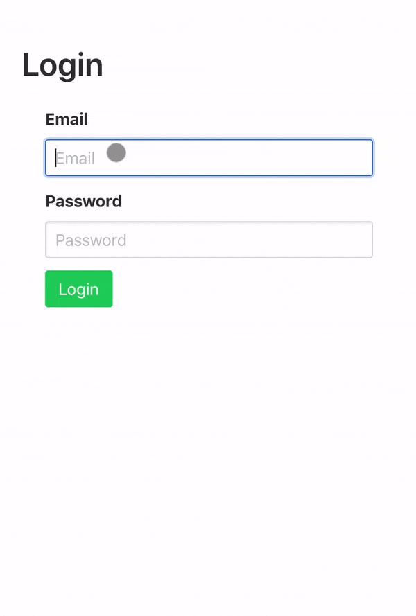

# AI-based Typing Biometrics Authentication
## Objective
This demo project illustrates how AI-based typing biometrics can be used in user authentication. To simplify machine learning process for the typing biometrics, Keystroke DNA API[1] has been utilized. The API analyzes the keystokes in a form field, and returns the analysis result. Based on the analysis, even if the password is matched, the authentication can be blocked and we can ask additional steps to validate users' authenticity.



Check out the AI-based biometrics authentication here.
You can use the mock credential typing@biometric.com/1234qwer

[https://typing-biometrics-auth-demo.herokuapp.com/](https://typing-biometrics-auth-demo.herokuapp.com/)

## Deep Dive
First, we need to register for our `app ID` and `app secret`. You would need to go here (https://keystrokedna.com/join) and submit the form. Once you get the credentials, place those credentials in `.env` file.

```
KEYSTROKE_DNA_APP_ID={YOUR_APP_ID}
KEYSTROKE_DNA_APP_SECRET={YOUR_APP_SECRET}
```

Then let's run the command `npm run dev`. The default port is 3000. Unless you set your custom port, you can access the app in `http://localhost:3000`.

Once the page rendered, the Keystroke DNA SDK script needs to be injected. And when the sciprt is loaded, you can run the API by calling `window.KSDNA.init()`.

```js
const loadKeystrokeDna = ({ appId, onLoad }) => {
  const KSDNA_SDK_URL = `https://api.keystrokedna.com/static/v0.4.1/ksdna.js?apiKey=${appId}`;
  window.KSDNA = window.KSDNA || {
    f: [],
    ready(callback) {
      if (window.KSDNA.loaded) {
        callback();
      } else {
        this.f.push(callback);
      }
    },
  };
  const script = document.createElement('script');
  const firstScript = document.getElementsByTagName('script')[0];
  script.ksdna = 1;
  script.async = 1;
  script.src = KSDNA_SDK_URL;
  script.onload = onLoad;
  firstScript.parentNode.insertBefore(script, firstScript);
};

loadKeystrokeDna({
    appId: "{KEYSTROKE_DNA_APP_ID}",
    oneLoad() {
        window.KSDNA.ready(() => {
          window.KSDNA.init();
        });
    }
});
```

Then the API looks for input fields with the attribute `ksdna`. Then, the keystoke sequence of the input field will be stored in the DOM element.

```html
<form><!-- keystroke pattern on the email field will be used by Keystroke DNA API-->
    <input id="email" type="text" placeholder="email" ksdna="true" />
    <input id="password" type="password" placeholder="password">
    <button type="submit">Submit</button>
</form>
```

When the form is submitted by users, the email, password, and the typing biometrics signature will be sent to the backend API.

```js
// a sample request payload
const emailDom = document.querySelector('form input#email');
const passwordDom = document.querySelector('firm input#password');
{
    publicCredential: emailDom.value, // typing@biometric.com
    privateCredential: passwordDom.value, // 1234qwer
    typingBiometricSignature: window.KSDNA.prepareSignature('email', emailDom.ksdna._dataset) //'email;1591589173431;t;0;86;;;y;199;319;;;o;400;495;;;u;720;767;;;Backspace;1016;1063;;;Backspace;1143;1239;;;p;1328;1399;;;i;1512;1584;;;n;1663;1800;;;g;1758;1847;;;b;2304;2408;;;Backspace;2670;2768;;;Shift;2695;2808;;;@;2759;0;;;b;2984;3063;;;i;3118;3199;;;o;3549;3623;;;m;3791;3903;;;e;3911;3983;;;t;4103;4152;;;r;4279;4359;;;i;4415;4495;;;c;4518;4599;;;.;4943;5055;;;c;5087;5215;;;o;5175;5239;;;m;5320;5415;;;Tab;5456;0;;'
}
```

Below is the `login` mutation that handles the payload from the login form. The first part is for the user credential validation. To simplify the demo, the validation is just to check the email and password values. So once the user credential is validated, we call Keystroke API, and the result stored in `ksdna` will contain the analysis performed by the Keystroke DNA's machine learning model. 

```js
const login = async (parent, { publicCredential, privateCredential, typingBiometricSignature }, { req }) => {
  if (publicCredential !== 'typing@biometric.com' || privateCredential !== '1234qwer') {
    return {
      authenticated: false,
      message: 'Invalid credentials',
    };
  }
  const ksdnaToken = await getKsdnaApiAccessToken();
  const ksdna = await getKsdnaScore({
    accessToken: ksdnaToken.access_token,
    username: publicCredential,
    value: publicCredential,
    typingBiometricSignature,
    ipAddress: getIpAddress(req),
    userAgent: req.get('User-Agent'),
  });
  const isSuspicious = !ksdna.success && !ksdna.failed;
  return {
    token: !isSuspicious ? Date.now() : null,
    authenticated: !isSuspicious,
    message: !isSuspicious ? 'Successfully logged in!' : 'Fraud attempt detected',
    ksdna,
  };
};
```

Below is the sample analysis against the input keystoke signature. The sample result can be used to determine if the authentication needs to be blocked even if the password authentication was successful. The `score` in the result ranges from 0 to 1. If it is close to 1, it means the submitted signature matches to the biometric profile of a user. And also, `success` and `failed` parameters indicate if the score is higher/lower than the defined success/fail threshold respectively.

```js
const ksdna = {
  signatureId: "18f607e3-a351-44f4-a5fd-4edbe257aece",
  success: false,
  failed: true,
  deviceHash: "2cbd3688d2129f4b00a049f42dcc2a1a7bee614b",
  completeness: 1,
  status: 3,
  score: 0.044
}
```

The result was pretty amazing. I tried to login multiple times with the credential `typing@biometric`/`11111111`. And the `score` was mostly greater than 0.5. However, when my wife attempted to login with the same credential (hacking!), the API returned the result where `score` is 0 and `completeness` is 1 as well. So the API knew that another person was using my credential.

In the demo, I used `failed` and `success` parameters to guess fraud attempts. According to the documentation, it said the case where both `failed` and `success` return `false` can be considered as suspicious. So in such case, I blocked the user authentication. And a warning message was shown to the user. But since the result is based on the machine learning model, there can be possibility of false positives and false negatives. Thus, in the production login experience, more intelligent and sophisticated controls needs to be combined. For example, rather than blocking the user authentication, maybe a gentle email can be sent to users. But if the result strongly indicates the fraud attempt, additional authentication challenge can be given to users to prove their authenticity.

For more details information regarding the analysis data, please refere to here (https://keystrokedna.com/documentation/).

## References
1. https://keystrokedna.com/

## License
MIT
