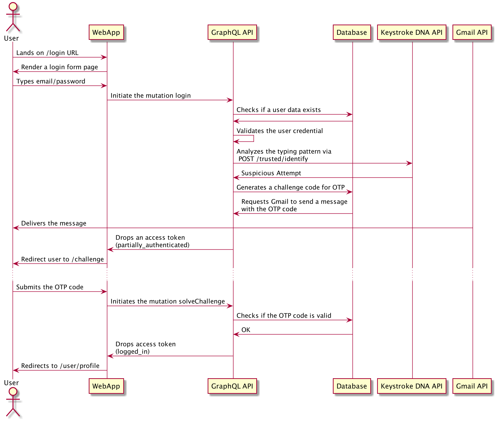

# AI-based Typing Biometrics Authentication
## Introduction
This technical design page describes detailed information regarding which techinques, components, and 3rd-party APIs have been utilized. And also future investigation and improvement are discussed at the end of the page.

## Components

|Component|Techniques|Description|
|---|---|---|
|Client - Web Application|<ul><li>React</li><li>Apollo Client</li></ul>|The client application of the project is a web application, and the React is used to render UI, and Apollo Client has been used to manage the data flow in the client.|
|Server - GraphQL API|<ul><li>Express</li><li>Apollo</li></ul>|The server component of the project is designed as a GraphQL API.|
|Database|<ul><li>MongoDB</li></ul>|For the databse, a NoSQL database MongoDB is used.|
|Email Service|<ul><li>Gmail API</li><li>Nodemailer</li></ul>|To provide an email delivery service, Nodemailer NPM module and Gmail API have been utilized.|
|AI-based Typing pattern Analysis|<ul><li>Keystroke DNA API</li></ul>|In order to analyze the user typing pattern, the 3rd party API, Keystroke DNA, is used. The API provides a simple and straightforward to detect if a submitted typing profile is matched with registered in the API via Machine Learning|

## Authentication Mechanism
In order to authenticate users in the project, three factors are used (1) password, (2) typing pattern profile, and (3) OTP code.

Anytime a user attempts to login, typing pattern on the email field is recorded and as part of the login mutation call, the typing pattern is sent along with the email and password.

By sending the typing pattern to the Keystroke DNA API, the analysis done through Machine Learning can be obtained. In the project, the status is divided into 3 categories (1) Approved, (2) Suspicious, and (3) New Device.

**Typing Pattern Analysis Response**
```json
{
  "signatureId": "1855cb8c-a76e-4f7f-94b5-ef091a3de241",
  "success": false,
  "failed": false,
  "deviceHash": "aeca33f6c2ddaefdaccdba754e695bbaa7a7601f",
  "completeness": 0.1,
  "status": 3,
  "score": 0.5
}
```
According to the official documentation, the New Device case can be identified by ``status = 2``. And the Suspicious case is where ``success = false`` and ``failed = false`` at the same time.

In addition to the official guideline, in this project, any case where either ``completeness < 0.9`` or ``score < 0.9`` is also considered as Suspicious case.

Thus, if a user is approved by the pattern analysis, the user is not required for any additional challenge. However, in case of suspicious attempt and new device login, additional OTP challenge is required, and only if the user successfully solve the challenge, the user will be fully authorized.

Once authentication is done, a JWT token is granted to users as a claim. The JWT token contains public user information and also the authentidation status.

For example, when a login is considered as suspicious or new device login attempts, a JWT token with ``partially_authenticated`` status is given, and the JWT can do only certain operations.

However, if a user logs in without additional challenge or solve OTP challenge, a JWT token with ``logged_in`` status will be given, and the status is the highest credential status, and can access to any operation in the app.

**JWT Token Example**
```json
{
  "email": "hoseong.a.lee@gmail.com",
  "status": "partially_authenticated",
  "iat": 1595578585,
  "exp": 1597378585,
  "iss": "SJSU_CMPE235"
}
```

## Use Cases
### Signup

Users are required to sign up providing their email and password to be used for subsequent logins. When the signip request is submitted, the email verification is sent to users. In order to verify user email, an ephemeral challenge code is sent via the user email. And by clicking a link in the email, the challenge code will be submitted, and it succeeds the user email verification step.

Once the email verification step is completed, users will be redirected to the login page, and users can login with the credentials used during the signup flow.

In addition to the email verification, the typing pattern collected in the sign up page is registered in the Keystroe DNA API. This creates a new typing pattern profile and a device record in the API.


### Login - Happy Path
If user email is verified, users can login on the login page. And if the typing pattern profile is matched with the profile registered in the Keystroke DNA API, no additional challenge is required, and users will be granted access token. The access token is a JWT-formatted string, and it contains a public user information and authentication status.


### Login - Suspicious Attempt
If a user login is identified as suspicious login from the application, the user needs to solve an OTP challenge. The OTP code will be sent to the user's email via Gmail API. And only if the user enters the valid OTP code in the challenge page and submit it, users will be given a full scope JWT token, and can login.



### Login - New Device Detected
In case of new device login, the steps will be similar to the suspicious login case. However, there are additional steps, but these are not required.

In addition to the OTP challenge code email, a new notification email for the new device login is sent to users. And if the users approve the device, the Keystroke DNA API will register the new device, and for subsequent logins, the application won't asks OTP challenge.

For example, if a user use multiple peronal devices, the user can approve all devices for faster logins. However, if the user logged in a public device, the user should not approve the device.


## Future Improvements
- Currently, the AI-based typing pattern analysis is being done via a 3rd party Keytroke DNA API. In future, the API can be replaced and have an on-premis Machine Learning model.

- Device detection logic is not based on browser. Ideally, each browser should be considered a new device. But the Keystroke DNA API does not differentiate devices by browser level.